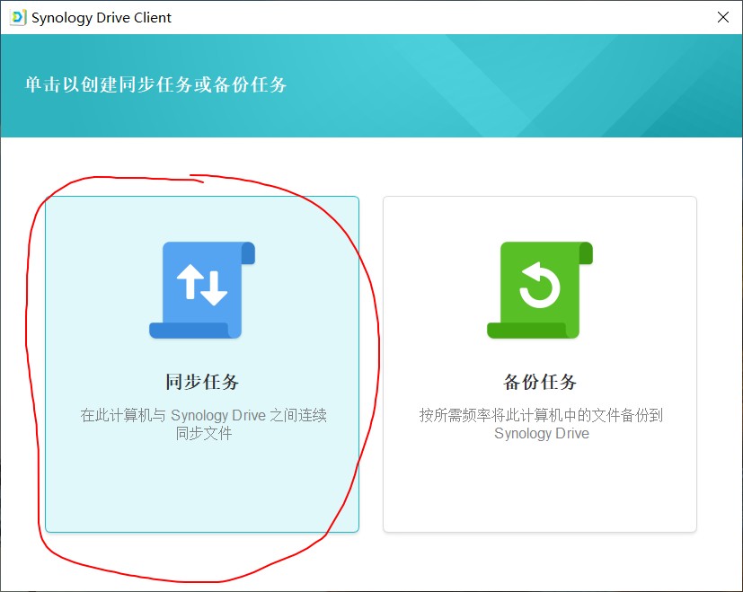

#群睴NAS实现文件异地同步
##实现逻辑
*	通过服务器软件Synology Driver Server与客户端软件 Synology Driver Client软件配合来完成备分同步功能
*	需要用到QuitConnectID来定位NAS服务器

##操作步骤

1. 服务器端安装Synology Driver Server套件
	*	套件中心 - 搜索 - Synology Driver Server
2. 客户端安装Synology Driver Clicent软件
	*	官网链接:[https://www.synology.cn/zh-cn/support/download/DS1618+#utilities](https://www.synology.cn/zh-cn/support/download/DS1618+#utilities "官网链接")
3. 服务器端启用团队文件夹，就是你想与其它用户同步数据的文件夹。如下图

4. 根据具体的需求选择需要同步还是备分，我们这里选择同步选项，如下图

5. 输入QuitConnectID与对应的用户名密码信息，如下图

6. 设定同步设置，<设定需要同步的NAS文件夹位置与本地需要保存的文件位置> 。 如下图

7. 高级设定的同步模式中选择仅从Synology Driver服务器下载数据。如下图:

8. 是否允许别人同步修改。我们这里选择以后再说，如下图:

9. 完成

##使用技巧
	* 若要同步最新的NAS文件，删除掉本地备分目录文件后，在客户端同步选项中选择双向同步.就会将NAS上同步的文件全部下载到本地。

